# Week 1 - Embedded Basics

## Overview
Welcome to BEEP! This first week focuses on getting comfortable with the embedded development environment and understanding the most fundamental concept in embedded systems: **General Purpose Input/Output (GPIO)**.

You will learn how to control the physical world using code (blinking an LED) and how to gather information from the world (reading a button).
---
## 1.1 Hardware

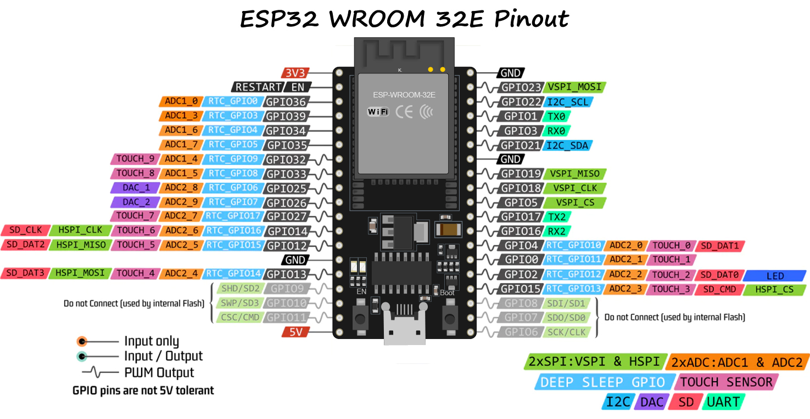

For this and all future activities, we will be using the **Sunfounder ESP32 Starter Kit**. [Here](https://docs.sunfounder.com/projects/esp32-starter-kit/en/latest/components/component_list.html) you can see the full component list as well as documentation for each included item. These activities will all start with hardware assembly, which requires that you understand how to read [KiCAD](https://www.kicad.org/) diagrams as well as find the correct components in your kit.  

If you're unfamiliar with KiCAD, there's a great introduction video [here](https://www.youtube.com/watch?v=vLnu21fS22s&list=PLUOaI24LpvQPls1Ru_qECJrENwzD7XImd). You shouldn't need more than the first video for the activities we will be doing (it walks through *creating* a schematic which is useful for learning how they work, but you will not be asked to create any of your own)

---
### 1.1.1 Breadboards

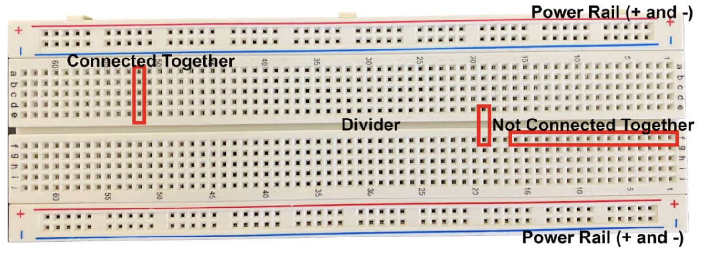

Breadboards are used to connect components without soldering. They are a great way to test and debug your circuit before solidifying a design. The pins are connected by numbered row with the exception of the power rails, which are connected to all of the other pins in their column rail. The + and - power rails are used to power external components, and it very important that you ***never*** connect them together directly, as this causes a short-circuit and damages equipment.

---

### 1.1.2 USB and Power

When programming your ESP32, you will need to connect it to your computer via a USB cable. This connection allows you to upload your code, send and receive data (like print statements), and provides power to the breakout board. There are 3 types of power pins (5V, 3.3V, and GND) that supply power from the USB cable to your breadboard and the external components on it. 

By convention, we will connect a 3.3V (**OR** 5V, but not both) pin to our positive (red) power rail, and a GND pin to our negative (blue) power rail. 

---

### 1.1.3 LEDs & Resistors

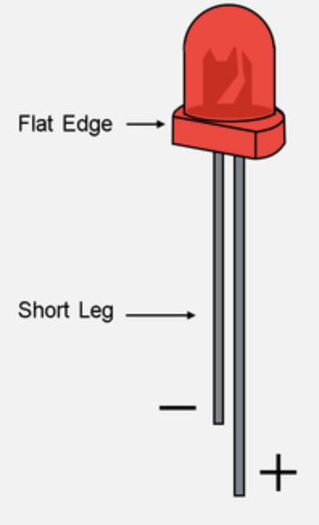
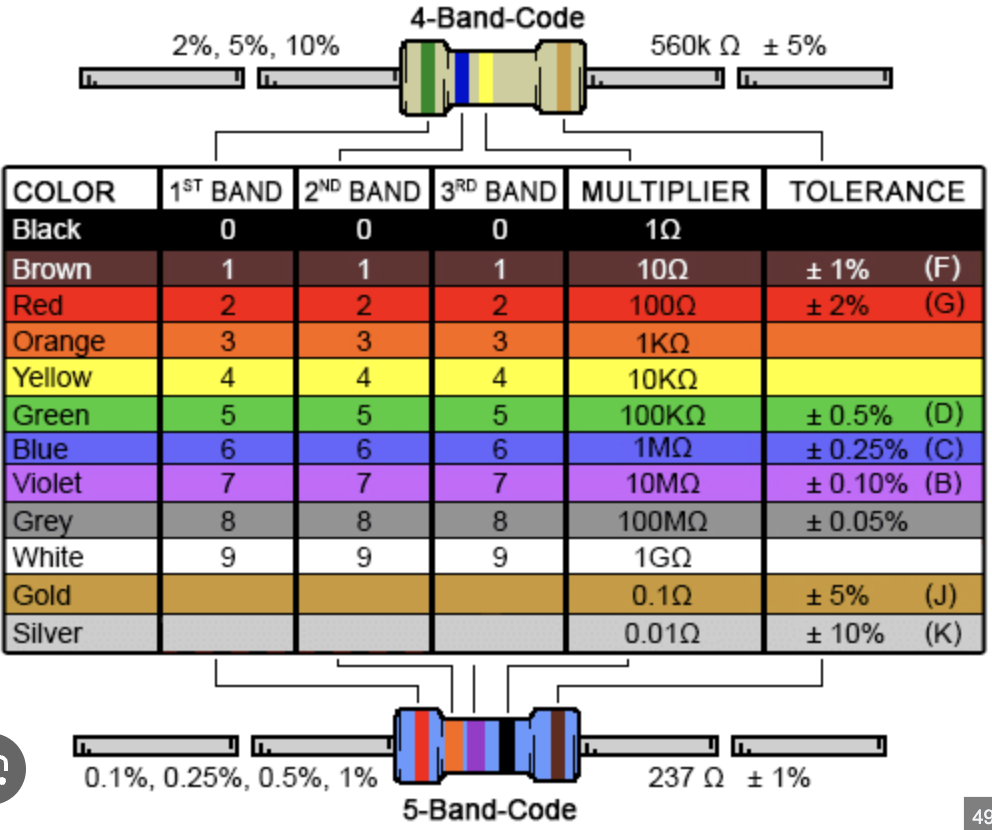

An <u>**LED (Light Emitting Diode)**</u> emits light when an electric current flows through it. LEDs are a type of Diode and diodes are polarized, meaning they have a positive (anode/ long leg) and negative (cathode/ short leg) terminal, and can only emit light when current flows from the anode to the cathode. To conceptually understand diodes, think about it as a one-way pipe valve that lets a unidirectional flow of current.

A <u>**Resistor**</u> is a device that resists or opposes the flow of current through it by creating a drop in voltage across it. An important concept to remember is Ohm's Law which gives the relationship between Current (I), Votlage (V), and Resistance (R) i.e. `V = I * R`.

#### <u>**Reading Resistance Values**</u>
Resistors use color-coded bands to indicate their resistance value and tolerance. To read them, always hold the resistor so the more densely packed bands are on the left, and the single, isolated band (the tolerance band) is on the right (Tolerance is not very important for this course but it is good to know). You then match the colors from left to right using the standard component color chart. Simply put:
* Identify if the resistor is 4-band or 5-band by counting the number of lines.
* The first 2 bands (for 4-band) or first 3 bands (for 5-band) represent the significant digits of the resistance value.
* The next band tells you what power of 10 to multiply your digits by (e.g., Red means multiply by 100, Yellow means multiply by 10k).

**Example:** A resistor with bands Green-Blue-Yellow translates to 5 (Green), 6 (Blue), multiplied by 10k (Yellow) — resulting in a 560kΩ resistor.


LEDs almost always need a current-limiting resistor to prevent burn-out, as they cannot handle as much as the microcontroller's pins can provide (ESP32s generally provide 3.3V as output from GPIO when they are high/active). The ESP32 has a built-in current-limiting resistor for each GPIO pin, but it is not always sufficient for LEDs. Any resistor from ~100-300 Ohms will work just fine.

---

### 1.1.4 Buttons

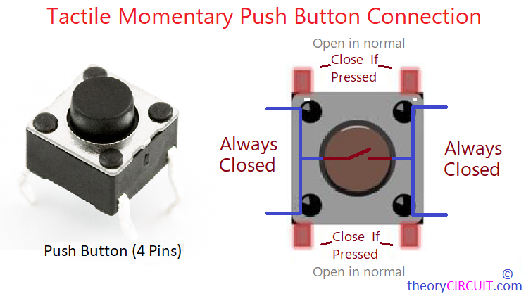

Buttons are one of the simplest user input devices in embedded systems. The buttons in your kit are **SPST (single pole, single throw)** switches — one switch, two contact points. The four physical pins on the button are arranged in pairs: the two pins on each side are already connected together internally, and pressing the button bridges the two sides.

Most button circuits connect one side to a GPIO pin and the other side to ground. When the button is **not pressed**, nothing connects the GPIO pin to ground, so the pin's voltage would be undefined — floating somewhere between 0 and 3.3V. This produces unreliable, garbage readings.

To fix this, we use a **pull-up resistor**. This ties the GPIO pin to the 3.3V rail through a resistor, guaranteeing the pin reads **high (1)** when the button is open. When the button is pressed, it creates a direct path to ground that overpowers the pull-up, and the pin reads **low (0)**. This "active low" behavior is important to understand — pressing the button reads as `0`, not `1`.

The good news: the ESP32 has **internal pull-up resistors** built in to every GPIO pin. We can enable them in software, which means you don't need a physical pull-up resistor in your circuit this week.

### 1.1.5 Circuit Setup

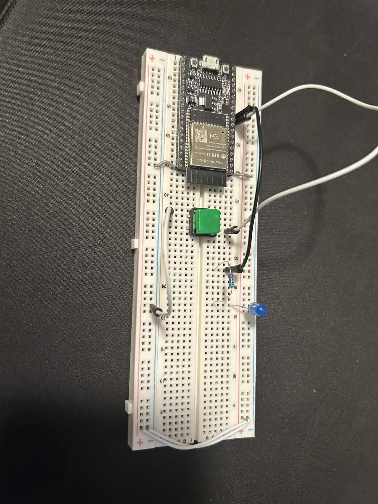

This week's circuit is simple, press the button and the light turns on, release it and it turns off again! As shown in the diagram:

* **LED**: Connect GPIO pin 27 → 220Ω resistor → LED anode (long leg). Connect LED cathode (short leg) → GND. The resistor can go on either side of the LED as long as it stays **in series**.
* **Button**: Connect one side of the button to GPIO pin 26. Connect the other side to GND. No physical pull-up resistor is needed — we will enable the ESP32's internal one in software.


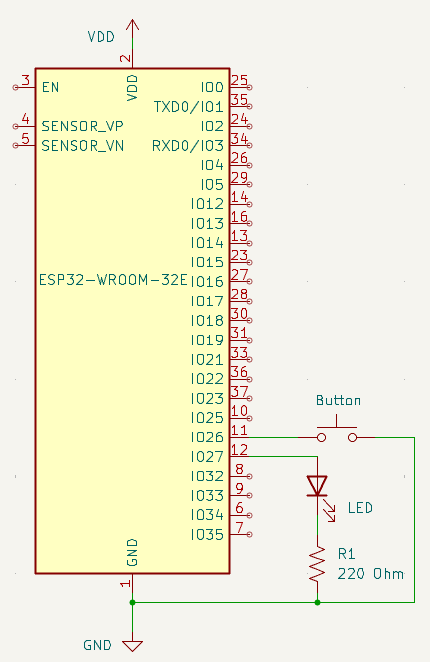


## 1.2 Environment Setup

We have chosen the *ESP-IDF* as the development environment for BEEP. To get started you must have [Visual Studio Code](https://code.visualstudio.com/download) downloaded. Click on the link and download the appropriate version for your OS if you don't have it already. The next step is downloading the *ESP-IDF* extension, which requires the following steps: 
1. Open VScode (*do not open a folder yet*), navigate to the **Extensions** tab on the sidebar, and search *ESP-IDF*. Install the one highlighted in this screenshot:    
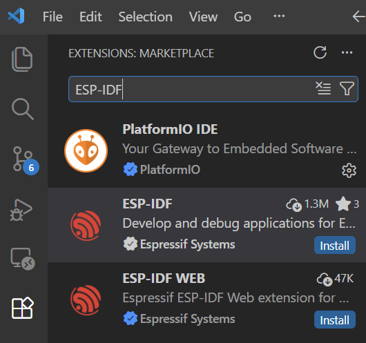

2. Click the **ESP-IDF: Explorer** button in the Extensions tab, open the **advanced** dropdown and click on **Open ESP-IDF Installation Manager**.   
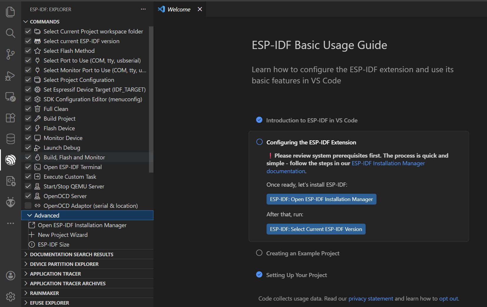
3. You may be prompted to select a mirror. If so, select **github**.   
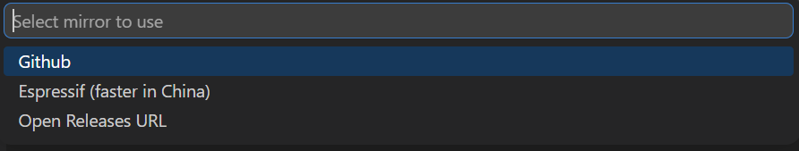

4. Now the **EIM** (Espressif Installtion Manager) should open, at which point you should click **Start Installation**.   
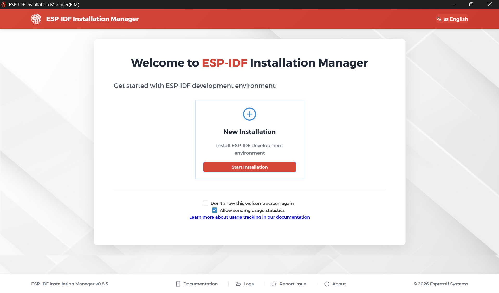

5. Select **Easy Installation**   
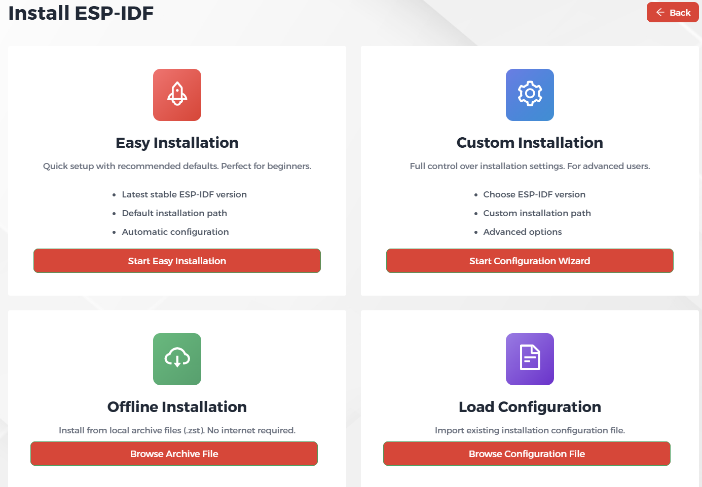

6. Then click **Start Installation** again and wait for the installation to finish (might take a while for some people don't worry. If you run into errors, ask for help).   
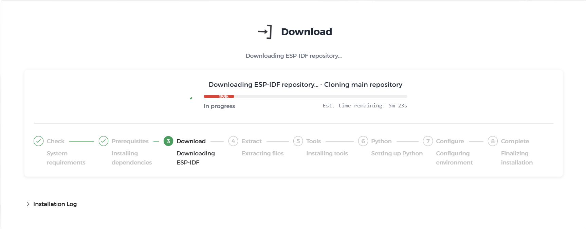

Once you have the extension installed, you should setup a parent folder to hold the individual week folders you'll be creating. For windows users we suggest placing it in your `C:\Users\{your username}` folder. This is not a requirement though, as long as you don't have any spaces in the filepath it will work. **DO NOT** place the parent folder inside of OneDrive as the filepath spaces will break the build system, if your windows/mac username has spaces in it come find one of the BEEP leaders and we will assist you. Now, open VSCode and do the following:

1. Press ```ctrl+shift+p``` to open up the VSCode command panel at the top of your screen
2. Search for ```ESP-IDF: Create New Empty Project```

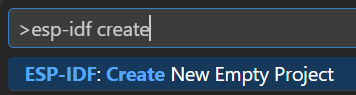

3. Enter a folder name in the popup window (entirely up to you)

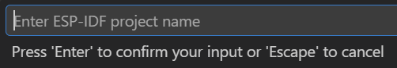

4. Select a location for the new folder, which should be inside the parent folder you created earlier (`C:\Users\{your username}`).

5. Open your new project folder in VSCode and replace the  ```main``` folder with the template main folder provided in this week's github repository.

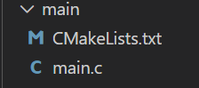

## 1.3 Software

### 1.3.1 Code Walk through
Now that you have your hardware and environment ready, you're almost ready to write some software! Open `main/main.c` in your editor. If you copied in the `main` folder from this week's github repository, you should see this:  
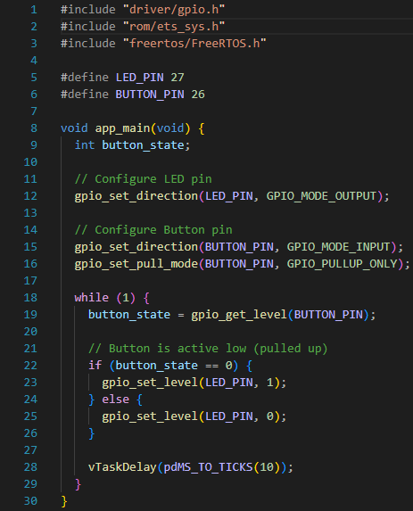

Let's go through it section by section.

**Include statements**
```c
#include "driver/gpio.h"
#include "rom/ets_sys.h"
#include "freertos/FreeRTOS.h"
```
These three lines pull in code from other files so we can use it here. All three are part of the ESP-IDF. `gpio.h` gives us all the functions for controlling GPIO pins. `ets_sys.h` gives us delay utilities. `freertos/FreeRTOS.h` gives us the `vTaskDelay` sleep function (more on this in a moment).

**Macros**
```c
#define LED_PIN 27
#define BUTTON_PIN 26
```
Macros are program-wide constants. At compile time, the compiler replaces every use of `LED_PIN` with the number `27`. This makes the code easier to read and means you only have to update one line if you ever rewire to a different pin. You will use macros like these in every future activity.

**app_main — Setup**
```c
void app_main(void) {
  int button_state;

  // Configure LED pin
  gpio_set_direction(LED_PIN, GPIO_MODE_OUTPUT);

  // Configure Button pin
  gpio_set_direction(BUTTON_PIN, GPIO_MODE_INPUT);
  gpio_set_pull_mode(BUTTON_PIN, GPIO_PULLUP_ONLY);
```
`app_main` is always where ESP-IDF programs begin execution. The first block of code here is **one-time setup**: we tell the GPIO peripheral which pins are inputs and which are outputs, and we enable the internal pull-up resistor on the button pin in software — no physical resistor needed.

**app_main — The Loop**
```c
  while (1) {
    button_state = gpio_get_level(BUTTON_PIN);

    // Button is active low (pulled up)
    if (button_state == 0) {
      gpio_set_level(LED_PIN, 1);
    } else {
      gpio_set_level(LED_PIN, 0);
    }

    vTaskDelay(pdMS_TO_TICKS(10));
  }
}
```
After the setup, every embedded program needs an infinite loop — `while (1)` runs forever. Each iteration reads the button, updates the LED, and then sleeps for 10 milliseconds.

**Active-low logic:** Notice that `button_state == 0` turns the LED *on*. This is the active-low behavior described in section 1.1.5. Because the pin is pulled up to 3.3V by default, it reads `1` when the button is open. Pressing the button pulls it to ground, so it reads `0`. The logic is therefore inverted from what you might expect.

**Why `vTaskDelay`?** The ESP32 runs FreeRTOS, a small real-time operating system (we'll cover this properly in Week 7). `vTaskDelay(pdMS_TO_TICKS(10))` puts the program to sleep for 10ms each loop. This matters for two reasons: it gives the CPU a moment to handle internal background tasks, and it limits how fast we're hammering the GPIO peripheral. Without it, the loop runs millions of times per second for no benefit. For now, just treat it as "sleep for 10 milliseconds."

> **Heads up for next week:** You may notice the LED flickers briefly when you press or release the button. This is called **bouncing**. We will solve this properly in Week 2 using software debouncing.

### 1.3.2 Setting Up Intellisense

To make navigating the codebase much easier, set up Intellisense. This lets you `ctrl+click` on any function or header file to jump directly to its definition — far faster than reading online documentation.

1. Download the **C/C++ VSCode Extension**.  
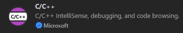

2. Press `ctrl+shift+p` and run **Add VS Code Configuration Folder**.  
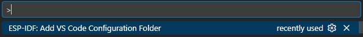

3. In the ESP-IDF sidebar, press **Build Project**. This may take a few minutes the first time. When it finishes, you should see a `build` folder appear:  
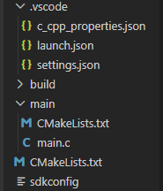

### 1.3.3 The Build System

The ESP-IDF build system compiles your C code into a binary and uploads it to the microcontroller. These are the commands you'll use:

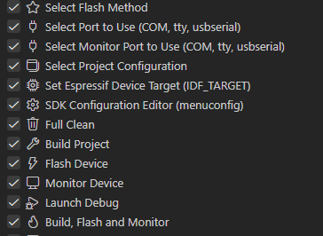

The three you'll use every week are:

* **`Build Project`** — Compiles your C source code into a binary. Run this every time you change your code.
* **`Flash Device`** — Uploads the compiled binary to the microcontroller's flash memory.
* **`Monitor Device`** — Opens a terminal to view print statements from the running program. Not required this week, but useful for debugging in future weeks.

You also need to run these **once per new project**:

* **`Select Flash Method`** — Run this and select **UART**.
* **`Select Port to Use`** and **`Select Monitor Port to Use`** — These select which USB port the ESP32 is connected to. After clicking, a popup will appear:  
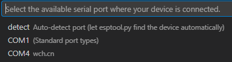  
Always select the port with the unique manufacturer ID next to it (`wch.cn` in this case).

**If no COM ports appear or flashing fails:**
1. Try a different USB cable or port first — this is the most common cause.
2. If the cable is fine, your USB port may be power-delivery only (no data).
3. On Windows, you may need to install the USB-to-UART driver. Download the latest **CP210x Universal Windows Driver** from [this link](https://www.silabs.com/software-and-tools/usb-to-uart-bridge-vcp-drivers?tab=downloads), unzip it, open Device Manager, and install the driver:  
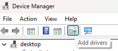  
Restart VSCode and try again.

* **`Full Clean`** — Deletes the build folder entirely. Useful as a last-resort fix for strange build errors.

---

## 1.4 Activity

This week's code is fully provided — your job is to flash it and verify it works. Once you have the LED responding to the button, try these modifications to get comfortable with the code:

### To Do

1. **Flash the template code** and confirm the LED turns on when the button is pressed and off when released.

2. **Change the behavior** so the LED is on by default and turns *off* when the button is pressed. You only need to change two characters in `main.c`. Think about what active-low means.

---

## 1.5 Helpful Links

#### Documentation
* [Sunfounder ESP32 Starter Kit Component List](https://docs.sunfounder.com/projects/esp32-starter-kit/en/latest/components/component_list.html)
* [ESP32 WROOM 32E Pinout](https://docs.sunfounder.com/projects/umsk/en/latest/07_appendix/esp32_wroom_32e.html)
* [ESP-IDF GPIO API Reference](https://docs.espressif.com/projects/esp-idf/en/stable/esp32/api-reference/peripherals/gpio.html)
* [ESP-IDF Full API Reference](https://docs.espressif.com/projects/esp-idf/en/stable/esp32/api-reference/index.html)

#### Environment Setup
* [IDF Frontend (if you're curious)](https://docs.espressif.com/projects/esp-idf/en/stable/esp32/api-guides/tools/idf-py.html)
* [Dev Container Setup](https://docs.espressif.com/projects/vscode-esp-idf-extension/en/latest/additionalfeatures/docker-container.html)
* [WSL](https://learn.microsoft.com/en-us/windows/wsl/basic-commands)
* [USBIPD](https://github.com/dorssel/usbipd-win)

---

Come back next week to learn about **MCU Architecture, Debouncing, and Program State**!